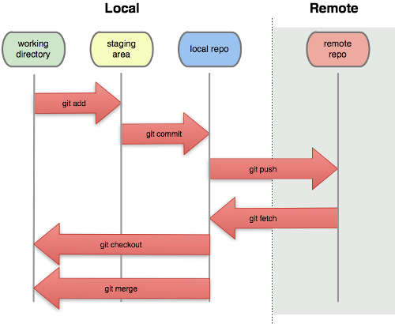

================================================================================
Intégration continue
================================================================================

Objectifs du cours
********************************************************************************

Objectifs
================================================================================

Ce cours est avant tout une introduction à certains outils, à certaines
techniques parfois utilisées dans l'industrie afin de favoriser les
développements logiciels.

Il n'est pas question ici de vous faire devenir spécialiste des technologies
présentées.

Contrôle de version
********************************************************************************

Problématique
================================================================================

Les codes sont :

- Écrits en équipe

  - Échanges des codes
  - Justification des modifications.

- Pensés de façon modulaire (on espère)

  - Interventions indépendantes sur les codes.
  - Divergence des bases de codes

Plusieurs problèmes peuvent être dégagés.

1 - Échanger les codes
================================================================================

Première approche :

- Envoi de fichiers sources par mail.
- Faire un mv / un copier coller.

Compréhension difficile de l'évolution des codes.

1 : Utiliser des *diffs*
================================================================================

Dans un travail collaboratif, les fichiers évoluent petit à petit. Pour
comparer deux versions d'un même fichier, on peut utiliser un *diff*

Identification immédiate des évolutions. Le diff permet de voir rapidement
les lignes :

- modifiées
- ajoutées
- supprimées

1 : Utiliser des *diffs* - exemple
================================================================================

On compare deux fichiers :

::

  Hello
  world
  bonjour monde !

et

::

  Hello !
  bonjour monde !
  Au revoir !

1 : Utiliser des *diffs* - résultat
================================================================================

Un exemple de diff pour le fichier précédent.

::

  % diff -y fic fic2               
      Hello               | Hello !
      world               <
      bonjour monde !       bonjour monde !
                          > Au revoir !

On retrouve bien tous les types de modification dans le diff.

1 : Utiliser des *diffs* (1)
================================================================================

Le résultat d'un diff peut être utilisé sur l'ancienne version d'un fichier
pour produire la nouvelle version. On applique un *patch*. Un développeur peut
utiliser un diff pour mettre ses codes à jour.

Des limites persistent :

- Pas de concept de projet
- Pas de gestion des ajouts/suppression de fichiers
- Plusieurs types de diffs... On utilise généralement des "diffs unifiés" pour
  simplifier les échanges.
 

2 - Justifier les modifications
================================================================================

Une modification, donnée seule, peut être difficile à comprendre :

- Introduction de nouvelles fonctionnalités
- Diff de grande taille
- Modifications subtiles...

Solution -> Joindre un message explicatif à chaque modification

3 - Maintenir un historique des modifications
================================================================================

Soit une équipe de développement en train de bosser sur une appli web avec
authentification...

Identification par mot de passe... "encodés" en base64.

3 - Maintenir un historique des modifications
================================================================================

Qui a introduit ce code ?

Depuis quand est-il en place ?

3 - S : Mettre en place un système d'historique
================================================================================

À combiner avec un système d'authentification

- Analyse de l'évolution du code
- Association des modifications avec des développeurs
- Savoir exactement à partir de quand un bug a été introduit dans la base de
  code. Cela permet, par exemple, de savoir exactement quelles versions d'un
  logiciel sont affectées par une faille de sécurité.

3 - L'historique et les suppressions accidentelles
================================================================================

L'historique permet de se mettre à l'abri des suppressions accidentelles des
fichiers qu'il contient. En cas de suppression accidentelle, on peut :

- Retrouver la dernière version du fichier dans l'historique
- Rétablir le fichier supprimé à partir de cette version.

Les modifications non publiées sont perdues.

Cette fonctionnalité justifie, à elle seule, le versionnement.

4 - Permettre les divergences et convergences des codes
================================================================================

Dans un logiciel, on trouve parfois plusieurs briques. Plusieurs personnes
peuvent être amenées à modifier des fonctions différentes.

- Interventions parfois longues
- Travail sur la base de codes commune -> Blocage pour tout l'équipe (il va y
  avoir de la casse temporaire)
- Travail dans son coin, modification en une seule fois dans la base de codes ->
  Modification incompréhensible...

4 - S : Permettre le suivi des codes qui divergent, simplifier les convergences
================================================================================

Création de **branches** pour les travaux indépendants.

- Protection de la base de codes commune
- Suivi des modifications, qui peuvent devenir atomiques.

besoin d'outils de convergence : Problème commun à l'application de patches.

En résumé...
================================================================================

On a besoin de systèmes capables de...

- Gérer les modifications dans les codes de façon différentielle.
- Permettre aux développeurs de justifier leurs modifications
- Fusionner les codes.
- Maintenir une historique de l'évolution des codes.
- Créer et fusionner des branches.

Les outils de gestion de version
================================================================================

CVS, SVN, Mercurial, Git, Bazaar...

Deux grandes "familles" :

- Les systèmes centralisés
- Les systèmes décentralisés

Les systèmes centralisés
================================================================================

SVN, CVS...

Un serveur commun à tous les développeurs.

Gestion du versionnement sur le serveur.

.. image:: workflow-centralized.png

Les systèmes centralisés - limites
================================================================================

- Rigidité

  - Impossible de commiter "dans son coin"
  - Impossible de créer des branches rapidement
  - Nécessité d'être connecté
  - Conventions architecturales

Les systèmes centralisés - limites
================================================================================

- Lenteur - latence réseau
- Fusion des branches difficile
- *Politique*

Les systèmes décentralisés
================================================================================

Git, Mercurial, Bazaar, Darcs

Pas forcément de dépôt central.

Un dépôt par développeur.

Grande liberté dans le fonctionnement (on peut même faire du centralisé).

.. image:: workflow-blessed-repo.png

Les systèmes décentralisés - Ajouts (1)
================================================================================

Une étape supplémentaire : le push. Le commit (ainsi que quasiment tout le
reste) est désormais local.

Les systèmes décentralisés - Ajouts (1)
================================================================================

Les systèmes décentralisés - Ajouts (2)
================================================================================

Plus de latence réseau sur :

- le commit
- consultation des logs
- manipulation des branches
- …

Les systèmes décentralisés - Ajouts (3)
================================================================================

Moins de contraintes sur les commits (un commit peut représenter un état
intermédiaire)

- Commits atomiques
- Expérimentations

Les systèmes décentralisés - Ajouts (4)
================================================================================

Séparation claire des projets - un dépôt par projet

Branches locales

- liberté sur la création des branches
- l'opération est plus simple

Les systèmes décentralisés - Ajouts (5)
================================================================================

Plus de contraintes sur l'état de la branche de travail

- Pas possible de faire un "push" si la branche de travail courante n'est pas 
  propre
- Obligation de présenter un état cohérent aux autres développeurs

Et aussi dans git...- Ajouts supplémentaires
================================================================================

- staging area
- bisect
- rebase
- cherry-picking
- stash
- …

Malgré tout, quelques avantages des systèmes centralisés
================================================================================

Malgré leurs fonctionnalités souvent plus limités, les systèmes de versionnement
centralisés présentent quelques avantages :

- La centralisation rassure les managers
- La mise en commun est directe - il n'y a qu'un seul point d'entrée.
- L'ancienneté est un atout : beaucoup de solutions reposent nativement sur les
  systèmes centralisés ou proposent des clients permettant de s'y connecter.
- Souvent besoin de plus d'étapes pour faire la même chose.
- Tous les projets sont au même endroit. Avec leurs branches, leurs tags...
  Tout...

Malgré tout, quelques avantages des systèmes centralisés (2)
================================================================================

- Moins de concepts à apprendre. Il faut savoir commiter, mettre le dépôt local
  à jour, éventuellement savoir déplacer des dossiers, et c'est à peu près tout.
- Plus de liberté dans les systèmes décentralisés -> plus de risques. Il est
  plus compliqué de tricher sur l'historique dans Subversion que dans Git. A
  contrario, il est aussi presque impossible de corriger une erreur dans
  l'historique de SVN. Attention aux "mensonges" dans l'historique

Dans tous les cas, il vaut mieux un système de versionnement que pas de
versionnement du tout.

Quelques bonnes pratiques de versionnement
================================================================================

Les fichiers à ne **jamais** commiter/pusher : 

- Les fichiers compilés (Les *.class* en Java, les *.o* en C...)
- Les fichiers de configuration inutiles pour le projet (Au hasard les fichiers
  de configuration d'Eclipse, Netbeans ou autre...)

-> Utilisez les marqueurs à disposition (svn:ignore, .gitignore...) pour éviter
de commiter n'importe quoi.
-> Vérifiez ce que vous vous apprêtez à commiter

Quelques bonnes pratiques de versionnement
================================================================================

- Ne **jamais** commiter en aveugle
- Commiter souvent pour rendre les commits aussi lisibles que possibles.
- Ne pas oublier que certains outils doivent être utilisés avec parcimonie (git
  rebase, par exemple)
- …

Quelques bonnes pratiques de versionnement - git
================================================================================

- Utiliser la *staging area*
- ``git add --patch`` pour choisir les modifications à commiter
- ``git commit --verbose`` ou ``git diff --cached`` pour voir ce que l'on
  s'apprête à commiter
- …

Les pull requests au coeur des systèmes de versionnement centralisés
================================================================================

Quid d'une transition centralisé -> décentralisé ?
================================================================================

Les architectures existantes sont souvent un frein à l'adoption des systèmes
décentralisés.

*Je vois bien l'intérêt de Git, mais nous utilisons Subversion, c'est trop
compliqué de migrer...*

Des outils existent qui permettent de faire la migration. Cela permet même
de corriger des accidents qui ont pu survenir dans l'historique... Attention,
la transition est parfois douloureuse pour une partie de l'équipe, au début...

Quelques ressources
================================================================================

Pour SVN :

http://svnbook.red-bean.com/
http://stackoverflow.com/questions/871/why-is-git-better-than-subversion

Pour git :

http://whygitisbetterthanx.com/
http://book.git-scm.com/

Pour Mercurial :

http://hgbook.red-bean.com/

Quelques ressources
================================================================================

Pour Darcs :

http://en.wikibooks.org/wiki/Understanding_Darcs

"10 things I hate about Git"

https://steveko.wordpress.com/2012/02/24/10-things-i-hate-about-git/

Un peu d'ironie :

http://blog.cedarsoft.com/2010/01/top-10-why-subversion-is-better-than-git/

Ce document est versionné sous git :

``git clone https://github.com/divarvel/gelol-ci.git``

Revue de code
********************************************************************************

Problématique
================================================================================

Détecter les erreurs au plus tôt dans le cycle de développement.

Autant que faire se peut… avant la mise en production.

Solution
================================================================================

Pratiquer la *revue de code*

- Relecture (systématique ou non) avant intégration du code
- Améliore la qualité du code
- Très bon mécanisme de formation

La revue de code
================================================================================

On peut procéder de plusieurs façons :

- Commit par commit
- Avant intégration du code (branches)
- En direct (pair programming)

Commit par commit
================================================================================

Surveiller les commits qui passent et les relire un par un.

Demander des modifications après coup.

Adapté si on utilise un système de versionnement centralisé, sans branches

Fastidieux

Avant intégration du code
================================================================================

Si chaque développement a sa branche, on peut relire le code avant la fusion
de la branche.

Marche aussi si chaque développeur a son dépôt.

Facilité dans github grâce aux *pull requests*

Le principe des pull requests
================================================================================

Chaque développeur dispose de son espace de travail. Il peut modifier les codes
indépendamment du reste de l'équipe. Quand les développements sont prêts :

- Demande d'intégration des modifications dans la base de codes. C'est la
  *pull request*
- Validation (ou non) par l'équipe de développement
- En cas de validation : intégration des codes dans la base de codes.

En direct - Pair programming
================================================================================

Un poste de travail pour deux. Un développeur code, l'autre commente / guide /
pointe les erreurs.

- Gain de productivité appréciable (idéalement supérieur à un facteur 2).
- Permet de faire prendre en main cocnrètement une technologie
- Au coeur de l'extreme programming (XP)

Builds automatisés
********************************************************************************

Problématique
================================================================================

Logiciels écrits en équipe.

Phase de compilation / assemblage pas toujours évidente (dépendances, …)

Opérations **très** répétitives et chronophages si elles sont faites à la main.

Besoins
================================================================================

Le système de gestion de versions

- Rendre les opérations reproductibles
- Automatiser les taches
- (éventuellement) brancher des traitements additionnels
- Modulariser les traitements
- Ajout rapide de développeurs à une équipe

Make
================================================================================

Framework d'écriture de scripts

Fonctionne sur le principe de **cibles**.

- actions associées à chaque cible
- dépendances entre cibles

Make
================================================================================

Mais

- pas de gestion des dépendances
- beaucoup de code à écrire
- dépend du système

Dans les faits :

- Makefile généré automatiquement
- dépendances gérées par le système d'exploitation
- dépendances vérifiées durant la phase de configuration

::

  ./configure
  make
  make install

Ant
================================================================================

Très répandu dans le monde Java.
Scripts écrits sous forme de XML

Mais

- Pas de gestion des dépendances
- Beaucoup de code à écrire

Dans les faits :

- Une fois que le script Ant fonctionne, on n'y touche plus.
- Associé à Ivy pour gérer les dépendances

Maven
================================================================================

Projet décrit dans un **POM** (Project Object Module)

Sert (entre autres) à *télécharger l'Internet*

Convention over Configuration :

- *sensible defaults* : dans la plupart des cas, les valeurs par défaut sont
  les bonnes - Moins de choses à expliciter
- mais possibilité de sortir des clous

Très répandu dans le monde java.

Maven
================================================================================

Contenu du POM :

- dépendances
- relations de parenté entre modules
- configuration des modules maven

  - Version de Java utilisée pour la compilation
  - Module de création d'exécutables (jar)
  - Génération de documentation

Maven - les dépendances
================================================================================

Maven est capable de gérer les dépendances d'une bibliothèques.

- Gestion des dépendances directes
- Gestion des dépendances indirectes (dépendances de dépendances
- Gestion des dépendances par phase de construction

Maven - Repositories
================================================================================

Bibilothèques rangées dans différents dépôts.

- Dépôt Central
- ``repo2.maven.org``

Dépôts tiers

- Dépôt scala-tools
- Dépôts "maison"
- Dépôts "cache" pour soulager la bande passante

Maven - Goals
================================================================================

Différentes phases au sein du cycle de vie d'un projet. Par exemple :

- compilation
- tests
- empaquetage
- installation
- déploiement
- nettoyage

Dépendances entre les différents *goals*. Intérêt : on ne peut pas faire un
déploiement innocent d'une bibliothèque dont des tests sont cassés...

Maven - Archetypes
================================================================================

Les conventions ont un rôle très fort -> on construit toujours les mêmes 
projets

- Génération à partir de squelettes
- Utilisation des "archetypes".

::

  mvn archetype:generate

donne une liste d'archetypes disponibles par défaut.

Maven - Projets modulaires
================================================================================

Un projet est rarement monolithique. Il est en général composé de différentes
parties peu couplées, mais interdépendantes.

Par exemple, pour un navigateur web :

- Moteur de rendu HTML
- Moteur Javascript
- Interface graphique

Il est alors judicieux de séparer ce projet en modules distincts

Maven - Quelques cas d'utilisation... (1)
================================================================================

::

  mvn compile

C'est la phase de **compilation** : toutes les sources sont compilées,
après résolution des dépendances. Concrètement :

- Les dépendances sont résolues.
- Maven réunit les dépendances, éventuellement en interrogeant des serveurs distants
- En cas d'échec -> erreur de compilation... ;-)
- Le *classpath* du compilateur Java est alimenté comme il se doit.
- Les fichiers **.class** sont générés.

Maven - Quelques cas d'utilisation... (2)
================================================================================

::

  mvn test

Cette commande exécute les tests déclarés dans le projet.

Concrètement, que se passe-t-il ?

La phase ``mvn compile`` est lancée (dépendance préalable à l'exécution des tests.
On ne pourrait pas tester des codes qui ne compilent pas...)

Maven - Quelques cas d'utilisation... (2)
================================================================================

Les dépendances sur les tests sont résolues

Les tests sont compilés.

Les tests sont exécutés sur les codes.

**On a réalisé, en une seule commande, quatre opérations non atomiques !**

Toujours plus de fonctionnalités
================================================================================

Les fonctionnalités de maven peuvent être étendues par le biais de plugins.
Toute tâche sur le code qui est automatisable peut être réalisée par le biais
d'un plugin :

- Génération d'exécutables multi-plateformes
- Génération d'un zip contenant les sources
- Génération de la documentation développeur
- Déploiement de fichiers sur une machine distante

Et encore d'autres outils de builds...
================================================================================

D'autres outils de build existent, ne serait-ce que dans le monde de la JVM.

Gradle : 

- Grande souplesse dans la gestion des processus de build.
- Utilisation de Groovy pour décrire les phases de build.
- Compatible Maven.

SBT :

- Grande souplesse dans la gestion des dépendances
- Écrit en scala
- Fichiers de configuration très concis
- Compatible Maven.

Quelques ressources (1)
================================================================================

Pour make :

- http://www.gnu.org/software/make/

Pour Ant :

- http://ant.apache.org/

Pour Maven :

- Maven, the definitive guide, https://github.com/sonatype/maven-guide-en
- http://maven.apache.org/

Quelques ressources (1)
================================================================================

Pour Gradle :

- http://www.gradle.org/
- G. Mazelier, *"Build automatisé : à la découverte de Gradle"*, **GNU/Linux 
  Magazine France n°141**, pp 22-34

Pour SBT :

- https://github.com/harrah/xsbt/wiki

Tests automatisés
********************************************************************************

Objectif
================================================================================

- Définir ce qu'est un test unitaire
- Décrire les apports des tests unitaires
- Expliquer dans quels cas ils peuvent être écrits

Problématique
================================================================================

L'informatique est une disicipline déterministe.

Les logiciels sont rarement écrits en aveugle :

- Des spécifications décrivent un comportement attendu
- Les algorithmes sont pensés avant d'être couchés sur le papier

-> On peut décrire très souvent les entrées d'un traitement, et les résultats 
qu'il doit fournir en utilisant ces entrées

Deux mondes s'opposent
================================================================================

Dans un monde parfait : les développeurs sont beaux, ils codent sans introduire
de bugs dans les logiciels.

Dans le monde réel : les développeurs sont beaux, mais leurs codes ne marchent
pas toujours…

Deux mondes s'opposent - bis
================================================================================

1. Pour corriger les codes, on travaille en aval, et on fait uniquement du 
   debugging.

2. Pour détecter les erreurs dans le code le plus tôt possible, on travaille en
   amont, par exemple en écrivant des **tests unitaires**.

Les tests unitaires - définition
================================================================================

"En programmation informatique, le test unitaire est un procédé permettant de
s'assurer du fonctionnement correct d'une partie déterminée d'un logiciel ou
d'une portion d'un programme (appelée « unité » ou « module »)."

Merci *wikipedia* : .. http://fr.wikipedia.org/wiki/Test_unitaire

Dans les faits, qui est l'unité ?
================================================================================

Toute méthode / fonction dont les entrées et sorties attendues peuvent être 
décrites précisément.

Objectif : Tester les codes aussi largement que possible, dans leurs 
fonctionnements atomiques

Que teste-t-on ?
================================================================================

Les comportements attendus, décrits par les spécifications, par la doc...

- Les sorties attendues
- Les erreurs attendues.

Ce que les tests apportent
================================================================================

- Vérification de la validité du contrat passé entre les codes et leur 
  description
- Protection contre l'introduction des régressions dans le code

Ce n'est pas tout…

- Écrire des tests lors du développement d'une API force à la prendre en main
- Lire les tests associés à un code permet parfois de mieux comprendre leur
  fonctionnement.
- Utilisation avancée de l'API pendant le développement - La bibliothèque est-
  elle utilisable ?

Ce que les tests n'apportent pas, et n'apporteront jamais
================================================================================

Une couverture exhaustive de toutes les états qui peuvent être rencontrés dans
un logiciel.

- Trop grande complexité
- Comportements parfois inattendus. Certains bugs ne sont révélés que dans des
  configurations surprenantes... et peuvent être le fruit de l'interaction entre
  plusieurs briques logicielles pourtant indépendantes en apparence.

Ce que les tests n'apportent pas, et n'apporteront jamais
================================================================================

Mais surtout... **La présence de tests unitaires ne peut garantir l'absence
de bugs dans un logiciel**, et ce quelle que soit la couverture.

- Testing shows the presence, not the absence of bugs 
- Edsger Djikstra

Quid de la présence d'un bug dans les tests ?

Écrire les tests en premier
================================================================================

TDD - Test Driven Development : écrire les tests avant le code.

- Formalisation des spécifications
- Assurance de la couverture du code 

Écrire les spécifications en premier
================================================================================

BDD - Behaviour Driven Development : écrire les spécifications sous forme de
tests.

Les tests :

- sont écrits de manière intelligible
- décrivent simplement le comportement de chaque élément

- voir specs.scala

Écrire du code testable
================================================================================

- "J'aimerais bien faire des tests, mais mon code ne s'y prête pas"
- Difficile de tester du code en isolation
- Comment tester une interface graphique ?

Quelques bonnes pratiques
================================================================================

- Écrire des tests courts
- Écrire des tests clairs
- Documenter les tests

Écrire du code testable - Références
================================================================================

Quelques frameworks d'écriture de tests unitaires :

- Java : JUnit
- PHP : PhpUnit, Atoum (BDD)
- Ruby : Test::Unit (Unitaire) / Rspecs (BDD)
- Python : PyUnit
- Javascript : Jasmine
- Haskell : Quickcheck
- …

Deux liens utiles :

- Google Testing Blog : http://googletesting.blogspot.com/
- Relation Testable / Bien conçu : http://vimeo.com/15007792

Métriques
********************************************************************************

Objectifs
================================================================================

- Discuter les mesures de la qualité du code
- Découvrir comment évaluer les codes automatiquement

Problématique
================================================================================

- Le code est sans *bugs*, certes.

  - Mais est-il maintenable ?
  - Est-il évolutif ?
  - Fait-il saigner les yeux ?

- Nécessité de mesures plus fines que « Ça marche / Ça marche pas »

Une définition stricte de la qualité des codes ?
================================================================================

- Impossible : trop de paramètres à prendre en compte. On ne peut pas sortir une 
  "formule magique".
- Besoin de mettre en place des mesures dédiées.

Quelques métriques
================================================================================

- Style de codage
- Détection de copier / coller
- Complexité du code (complexité cyclomatique)
- Cohérence des méthodes et des classes
- Couplage entre les composants
- Abstraction / Viscosité
- …

1 - Le style de codage
================================================================================

Besoin de garder les codes lisibles :

- Indentation
- Espacement
- Longueur des lignes

2 - Détection de copier / coller
================================================================================

Repérage des lignes exactement similaires dans les codes

Objectifs :

- Simplifier la maintenance des applications
- Encourager la **factorisation** des codes
- Diminuer la quantité de codes à maintenir

3 - Complexité des codes - La complexité cyclomatique
================================================================================

Selon Wikipédia : "Cette mesure comptabilise le nombre de « chemins » au travers 
d'un programme représenté sous la forme d'un graphe"

Concrétement : on compte les appels à ``if``, ``else if``, ``case``, ``for``,
``while``, ``&&``, ``||``...

- Objectif : Garder les codes simples.
- Comment ?

  - Méthodes courtes.
  - Méthodes atomiques

3 - Complexité des codes - La complexité cyclomatique
================================================================================

- Effet de bord : les codes deviennent plus faciles à tester.
- Limites : L'implémentation de certains algorithmes nécessite d'écrire des 
  méthodes très longues, et qui sont "atomiques"...
- Exemple : Algorithme d'intersection robuste en 2 dimensions.

4 - Complexité des codes - La cohérence entre classes et méthodes
================================================================================

Principe : Repérer les méthodes orphelines, les groupes de méthodes 
indépendants, au sein d'une même classe.

Objectif :  Assurer le principe du devoir unique (*Single Responibility* 
*Principle*) : Une classe assure une fonction définie et unique.

Comment : En profitant du paradigme objet, en assurant une conception efficace.

Détection des mauvaises pratiques (1)
================================================================================

Dans certains langages, certaines façons de coder sont considérées comme des 
mauvaises pratiques. Par exemple, en Java :

- Ne pas s'assurer que les flux d'entrée/sortie ont bien été fermés
- Ne pas mettre d'accolades autour du bloc d'instructions d'un if s'il ne comporte
  qu'une seule ligne.
- Ne pas déclarer les "constantes" ``final``
- …

Détection des mauvaises pratiques (2)
================================================================================

Ces configurations peuvent être détectées, avec quelques nuances :

- On peut trouver des faux positifs.
- Toutes les violations n'ont pas la même gravité.
- De tels concepts ne peuvent être appliqués que sur des langages très 
  éprouvés. Ils sont longs à mettre en place, et représentent le fruit d'années
  d'expérience.

Les métriques et la dette technique
================================================================================

Comment expliquer simplement les problèmes mis en lumière par ces métriques ?

-> En parlant de **dette technique**

**La dette technique représente des parties de code non utilisées ou dans 
lesquelles il est difficile d'effectuer des modifications et évolutions.**

En **chiffrant** les problèmes recensés :

- Pour chaque problème et violation, chiffrer le temps moyen nécessaire à une
  correction, pour un développeur.
- Remplacer par le coût d'un développeur

La somme obtenue correspond à l'argent nécessaire en théorie pour résorber 
l'intégralité de la dette technique.

Quelques ressources...
================================================================================

Plein d'infos sur les métriques sur :

http://docs.codehaus.org/display/SONAR/Documentation

C'est la documentation de 

http://www.sonarsource.org

Pour la dette technique :

http://blog.xebia.fr/2011/09/30/livre-blanc-maitrisez-votre-dette-technique/

Intégration continue
********************************************************************************

Objectifs
================================================================================

- Faire fonctionner ensemble les outils abordés
- Aller au bout de l'automatisation

Problématique
================================================================================

Nous avons un ensemble d'outils sous la main (versionnement, outil de 
construction, tests unitaires, qualité de code...).

Des problèmes subsistent :

- Certaines tâches sont très lourdes (calcul des métriques)
- Nous ne sommes pas à l'abri d'un oubli - Même avec de bons outils, les
  développeurs font des erreurs ;-)

On met tout ensemble
================================================================================

- Système de versionnement
- Outil de construction
- Tests unitaires
- Calcul des métriques

Le système de versionnement...
================================================================================

Le serveur d'intégration dispose d'un accès aux codes (copie/dépôt local). Il
peut :

- Se connecter à la base de code
- Scruter les modifications
- Rapatrier la dernière version des codes.

L'outil de construction...
================================================================================

Lorsqu'une modification est rapatriée :

- Compilation des codes
- Exécution des tests 

On peut se servir des dépendances transitives et des projets riches :

- Construction des projets multi-modules
- Construction d'un projet après modification dans une dépendance (pour 
  vérifier qu'une modification extérieure n'a pas modifié le projet).

Les tests unitaires
================================================================================

Des tendances peuvent être dégagées de l'exécution des tests :

- Des tests ont été cassés ?
- Des tests ont été corrigés ?
- Dans quel sens la qualité logicielle évolue-t-elle ?

En cas de problèmes...
================================================================================

Des alertes peuvent être levées :

- Dans l'interface du serveur.
- Par mail.
- Par SMS (!).

Et aussi...
================================================================================

D'autres actions peuvent être déclenchées régulièrement, indépendamment de la
scrutation

Exemple : Calcul des métriques

Intérêt
================================================================================

- Vision claire de l'état du projet
- Assurance qualité en continu
- Tâches potentiellement lourdes déportées sur un serveur distant

Intérêt
================================================================================

- Fun (http://www.flickr.com/photos/unavoidablegrain/4622043091/sizes/z/in/photostream/)

Un exemple de serveur d'intégration
================================================================================

http://jenkins-ci.org/

Pour des infos sur le logiciel :

**Jenkins, the definitive guide**

Continuous delivery / deployment
********************************************************************************

Continuous delivery
================================================================================

- Après chaque build réussi, mettre à dispostion un livrable

Continuous Deployment
================================================================================

- Après chaque build réussi, mise en production immédiate

Les bénéfices sont multiples :

- *Faster TTM: time to market*
- *Feedback* utilisateur quasi immédiat
- Pas de gel de la base de code
- Logiciel continuellement utilisable
- Ajouts de code plus petits

  - Plus facile à *débug*

Cadres propices
================================================================================

SaaS - Software as a Service

- Environnement d'exécution contrôlé
- Changement accepté par les utilisateurs

